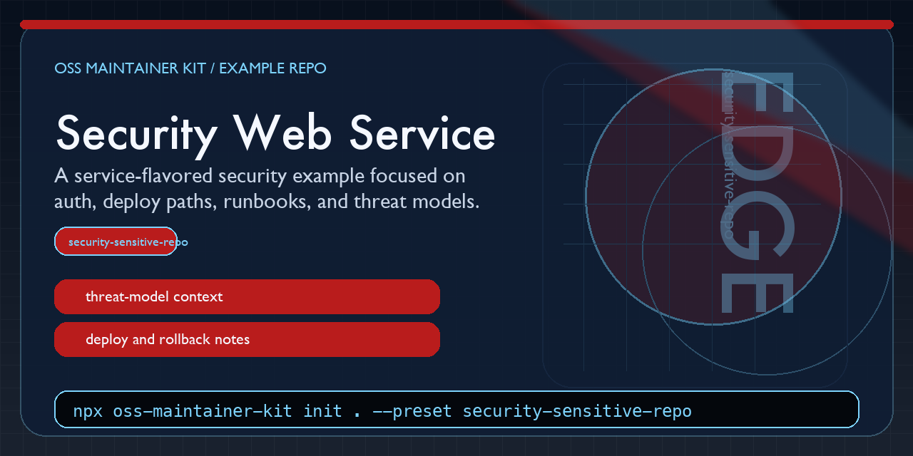

# OSS Maintainer Kit Security Web Service Example



This repository shows how the `security-sensitive-repo` preset can be used for a deployable web service rather than a packaging-heavy desktop or installer project.

It was generated with:

```bash
npx oss-maintainer-kit init . \
  --repo-name oss-maintainer-kit-security-web-service-example \
  --maintainer "Blake Hampson" \
  --preset security-sensitive-repo
```

## Why this repo exists

It is a concrete example for API and web-service repos where auth, deployment, logging, rollback, and infrastructure behavior need tighter maintainer guidance.

## Quick scan

- `AGENTS.md`: higher-scrutiny review priorities for sensitive code and deploy paths
- `docs/START_HERE.md`: how to orient maintainers and AI reviewers in a sensitive service repo
- `docs/MAINTAINER_WORKFLOW.md`: how to triage risk, validation, and docs sync
- `docs/ARCHITECTURE.md`: example system-boundary notes for a service
- `docs/THREAT_MODEL.md`: example threat-model outline for a service repo
- `deploy/README.md`: example deploy-surface notes worth reviewing before merge

## What this preset is trying to optimize

- tighter review discipline around auth, secrets, deployments, and runtime boundaries
- explicit validation expectations for operationally risky changes
- a starting point that does not enable optional Codex Actions by default

## Related project

- Main tool: <https://github.com/BlakeHampson/oss-maintainer-kit>
- npm package: <https://www.npmjs.com/package/oss-maintainer-kit>
- security case study: <https://github.com/BlakeHampson/oss-maintainer-kit/blob/main/docs/CASE_STUDY_SHULEDOCS.md>
